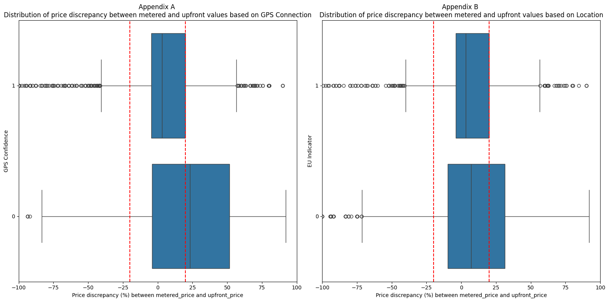
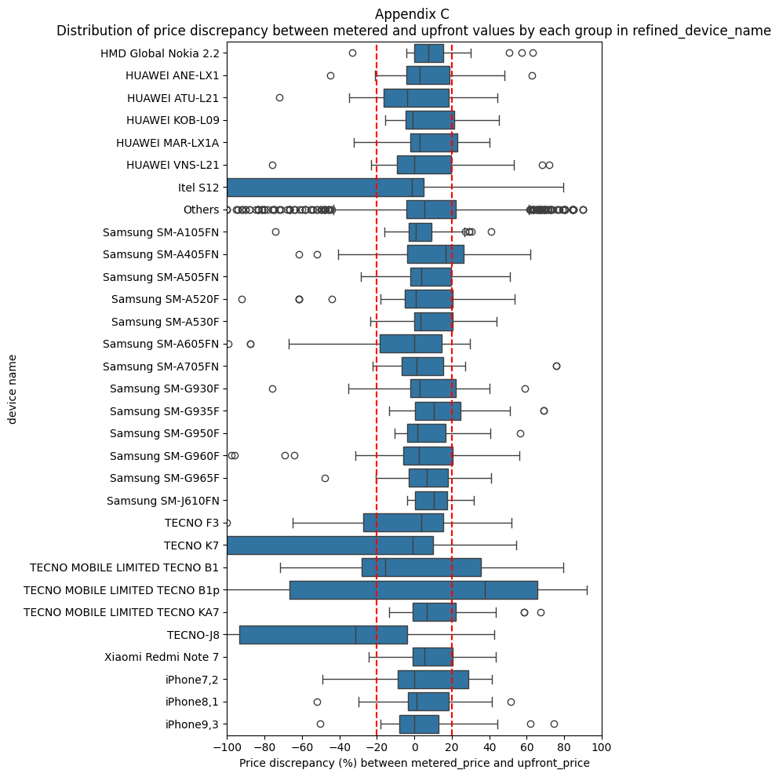
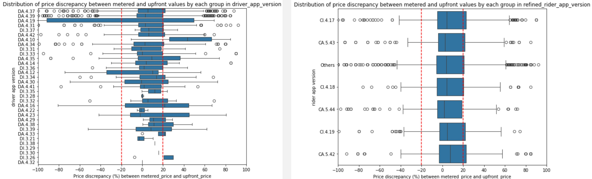
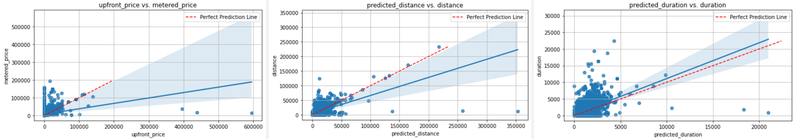
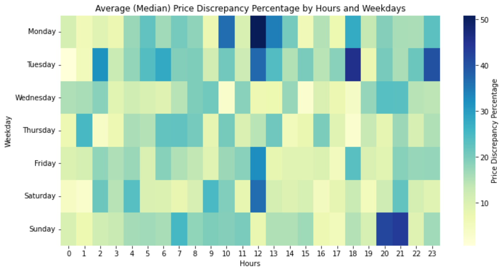

# upfront-pricing-precision
My client, a mobility company that offers ride-hailing, wanna identify the opportunities to improve upfront pricing precision in ride-hailing.

# Problem Definition

First, it predicts the price for a ride based on predicted distance and time. This price is what we see on the screen of the phone before ordering a ride. Second, if the metered price based on actual distance and time differs a lot from the predicted one, the upfront price switches to the metered price. 'A lot' or 'Discrepancy' means more than `20%`. For example, suppose a customer wants to make a ride that upfront price predicts a cost of 5 euros. If the metered price is between 4 and 6 euros, he/she will end up paying 5 euros. The customer will end up paying something else if the metered price is anything less than 4 or more than 6 euros. 

No customer likes surprises (especially when it comes to money!), that’s why we always strive to improve our upfront pricing precision for our customers’ smooth journeys. 

We would like to understand which factors contribute to more than 20% difference so that we could improve our prediction.

# Data Overview

* order_id_new, order_try_id_new: id of an order
* calc_created: time when the order was created
* metered_price, distance, duration: actual price, distance and duration of a ride
* upfront_price: promised to the rider price, based on predicted duration (predicted_duration) and distance (predicted_distance)
* distance: ride distance
* duration: ride duration
* gps_confidence: indicator for good GPS connection (1 - good one, 0 - bad one)
* entered_by: who entered the address
* b_state: state of a ride (finished implies that the ride was actually done)
* dest_change_number: number of destination changes by a rider and a driver. It includes the original input of the destination by a rider. That is why the minimum value of it is 1
* predicted distance: predicted duration of a ride based on the pickup and dropoff points entered by the rider requesting a car
* predicted duration: predicted duration of a ride based on the pickup and dropoff points entered by the rider requesting a car
* prediction_price_type: internal variable for the type of prediction:
* upfront, prediction: prediction happened before the ride
* upfront_destination_changed: prediction happened after rider changed destination during the ride
* change_reason_pricing: indicates whose action triggered a change in the price prediction. If it is empty, it means that either nobody changed the destination or that the change has not affected the predicted price
* ticket_id_new: id for customer support ticket
* device_token, device_token_new: id for a device_token (empty for all the fields)
* rider_app_version: app version of rider phone
* driver_app_version: app version of driver phone
* driver_device_uid_new: id for UID of a phone device
* device_name: the name of the phone
* eu_indicator: whether a ride happens in EU
* overpaid_ride_ticket indicator for a rider complaining about the overpaid ride
* fraud_score: fraud score of a rider. The higher it is the more likely the rider will cheat.

We have ~40% orders with price discrepancy.

# Insights
The analysis reveals that there are few factors which can be correlated to the inaccuracy in price prediction, including:

### GPS and location

- 20% riding orders have poor GPS connection, which shows more pricing inconsistency
- Rides outside the EU would likely experience more inconsistency in prediction than those in the EU. This would possibly mean there is a need for a region-specific or geolocation-based approach to enhance prediction accuracy, taking into account local factors that affect pricing.

### Device and Apps

- Also, the device characteristics can also affect the upfront prediction. Users with less common brands, such as Tecno, tend to experience less consistent predictions compared to users with more renowned brands like iPhone, Samsung, or Huawei. This suggests that device compatibility might play a role in pricing discrepancies.

- There're some noteworthy difference among different app versions for both riders and driver, too.

### Distance and Duration

- Since upfront_price was predicted based on `predicted_distance` and `predicted_duration`, it's understandable price discrepancy (`price_delta_perc` ) has strong correlation with `distance` and `duration`
- As we can see, while the duration prediction did a fair job, the distance prediction is a challengable. Thus, the price prediction was being affected
- Improving distance prediction could be one of the key factors to improve the upfront pricing

### Seasonality

- We can observe some patterns of pricing inconsistency during lunch time of Monday, Tuesday, Friday and Saturday, especially Sunday from 8 - 10 pm, Tuesday evening 6-7 pm and after 11 pm

# Opportunities for Improvement
In summary, as can be seen, the price discrepancy varies signficiantly based on GPS quality, driver app, device compatibility and location EU/non-EU. Some improvement we can think:
* Enhance prediction with device compatibility input: Device-specific modeling is used to tailor the prediction to the different behaviors of device brands. We could add the device as an extra input of the current predictor, or we could have multiple predictors based on different brands.
* Location-specific pricing model: Similar to device-specific modeling, we can adapt the same strategy to local geography context. For example, each location can have different traffic patterns, road conditions, or population which can affect traffic, especially during peak hours. Those can be valuable inputs for the predictor.
* GPS Connectivity Enhancement: We could also have a baseline/simple predictor in case the GPS quality is unreliable.
* User Feedback Integration: Encourage users (both drivers and riders) to give real time feedback about the ride via the app e.g.: traffic condition, any accident ... This information is really helpful especially in the situation where GPS connection is poor or when the predictor is uncertain. This strategy is called Active Learning.

